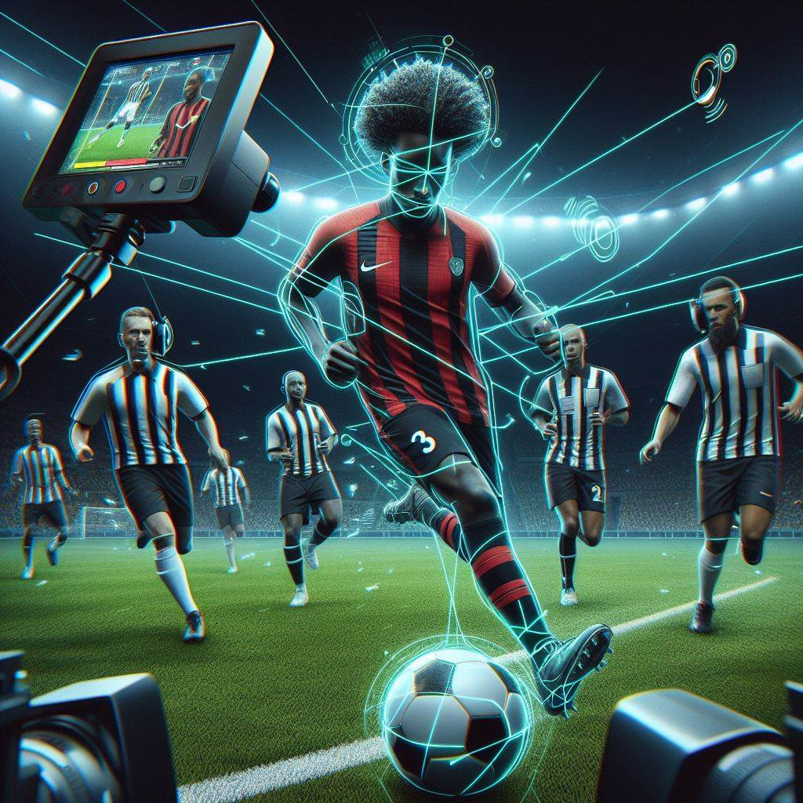

# Match Motion

## Author
Felipe Camargo de Pauli  
fcdpauli@gmail.com

## Description
A system to track the motion of the ball, players and referees in a football match.

## Todo:

### Target 1. The first match!
A system using the Opencv window that show the detections on videos passed as arguments.

> Functional requirements:

    [ ] You pass a video as argument of a match;
    [ ] A window shows the match with the correct detections.

> Technical requirements:

    [ ] Use for the MVP yolov5 (it's already annotated);
    [ ] Use bytetrack to track the ball and people;
    [ ] Get a system to evaluate the results.

### Target 2. Create a page using React to show the match and record stats
Soon...

### Target 3. Split the software into an API (engine) e the software (user)
Soon...